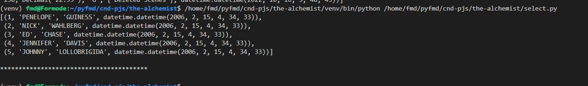

## Table of contents:
- [Introduction](#intro)
- [Technologies](#tech)
- [project Setup](#projo)
- [Illustrations](#illus)
- [Project Information](#info)
- [Contributing](#contri)
- [Acknowledgments](#know)

<INTRODUCTION>

<h1 id="intro">The Alchemist</h1>

Practises on mysql databases and sqlalchemy
 
<TECHNOLOGIES>

<h1 id="tech">Technologies</h1>

**Builth With**
- Python
- mysql
- sqlalchemy

**usage.**

The following options have been explored:
 - creating
 - delete
 - filtering
 - inserting
 - select
 - updating

<PROJECT-SETUP>

<h1 id="projo">Project Setup</h1>


## Hardware Requirements
- You will need a desktop or a laptop computer
- RAM: A minimum of 4GB RAM is recommended
- Disk Space: You should have at least 5GB free of space on your working hard drive

## Software Requirements

**environment**

The project was created in a wsl 2 (ubuntu/linux environment). 

**Prerequisites**

To get this project up and running locally, you must already have the following installed:
- [python plus the necessary packages installed on your computer](https://www.python.org/downloads/)
- [code editor ](https://code.visualstudio.com/)
- [mysql workbench installed](https://dev.mysql.com/downloads/workbench/)
- [mysql server](https://learn.microsoft.com/en-us/windows/wsl/tutorials/wsl-database)


**simple steps to set up on your local machine**

- [Import sakila database]( http://downloads.mysql.com/docs/sakila-db.zip)
- ```git clone https://github.com/symonkipkemei/api-database-chefbook.git```
- Set up and activate the virtual environment
-  ```pip install -r requirements.txt```
- explore the examples , try run them by yourself.


<ILLUSTRATIONS>

<h1 id="illus">Illustrations</h1>



<PROJECT-INFORMATION>

<h1 id="info">Project Information</h1>

**Project Status**
- Complete

**Features**
- Your suggestions 😊............


<CONTRIBUTING>

<h1 id="contri">🤝 Contributing</h1>

Contributions, issues and feature requests are always welcome!

I love meeting other developers, interacting and sharing.

Feel free to check the [issues page](https://github.com/symonkipkemei/api-database-chefbook/issues).

**How to Contribute**

To get a local copy up and running follow these simple example steps.

```
- Fork the repository
- git clone https://github.com/your_username/api-database-chefbook e
- git checkout develop
- git checkout -b branch name
- git remote add upstream https://github.com/symonkipkemei/api-database-chefbook e
- git pull upstream develop
- git commit -m "commit message"
- git push -u origin HEAD
```


<ACKNOWLEDGMENTS>

<h1 id="know">Acknowledgements</h1>

## Author

👤 **Symon Kipkemei**

- Github: [symonkipkemei](https://github.com/symonkipkemei)
- Twitter: [@symon_kipkemei](https://twitter.com/symon_kipkemei)
- LinkedIn: [Symon kipkemei](https://www.linkedin.com/in/symon-kipkemei/)


## Show your support


I can't promise to solve all your problems but I promise you won't have 
to face them alone 😊.

Finally, if you've read this far, don't forget to give this repo a ⭐️. 


## Acknowledgments

- [codingnomads](https://codingnomads.co/).
